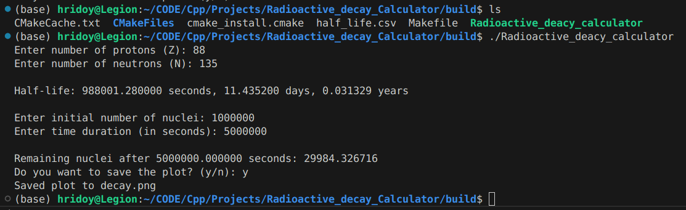
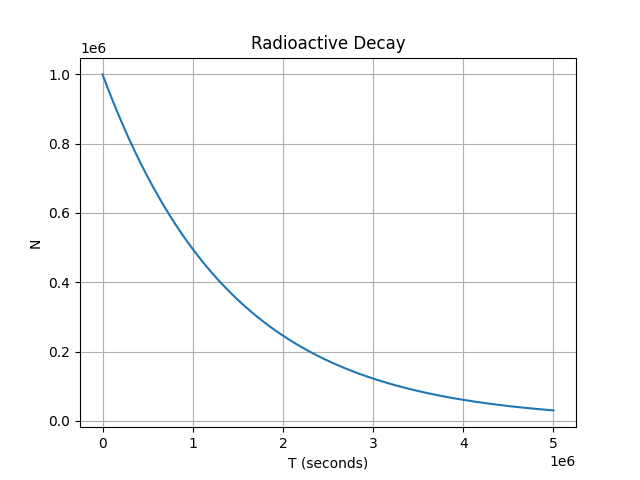

## Radioactive Decay Calculator

A small C++17 CLI app that looks up nuclear half-lives by proton number (Z) and neutron number (N), simulates exponential decay N(t), and plots the result using Matplotlib via `matplotlibcpp`.

### Features
- Reads half-life data from a CSV with columns: `z,n,halflife(Seconds)`.
- Treats `-1` half-life as stable or not available.
- Prompts for Z, N, initial nuclei count, and total time (seconds).
- Prints remaining nuclei after the given time.
- Plots N(t) and can save it as `decay.png`.

---

## Prerequisites
- Linux with a C++17 compiler (GCC/Clang) and CMake (3.28+ as set in `CMakeLists.txt`).
- Python 3.x with development headers (libpython) available to the compiler/linker.
- Python packages in the same environment:
    - NumPy
    - Matplotlib

The project uses CMake’s `FindPython3` and `FindNumPy`. If NumPy headers are not detected automatically, `CMakeLists.txt` currently contains a hard-coded NumPy include path you may need to update for your system or remove if discovery works automatically.

---

## Build
From the project root (`Redioactive_Decay_Calculator/`):

```bash
cmake -S . -B build
cmake --build build -j
```

This produces the executable:
- `build/Radioactive_deacy_calculator`

## Run
Run from the `build/` directory:

```bash
./Radioactive_deacy_calculator
```

You’ll be prompted for:
- Z (protons)
- N (neutrons)
- Initial number of nuclei
- Total time (seconds)

Choose whether to save the plot (`decay.png`) or show it interactively.

---

## Example session (abridged)


# Ploting Result

---

## Troubleshooting
- Error: “Could not open half_life.csv”
    - Ensure you’re running from `build/` and that `half_life.csv` exists there (not hidden as `.half_life.csv`).
- CMake cannot find Python or NumPy
    - Confirm Python 3, dev headers (e.g. `python3-dev`), and NumPy are installed. You can guide CMake with `-DPython3_ROOT_DIR=/path/to/python`.
- Linker errors referencing Python symbols
    - Install your distro’s Python dev package (e.g., Debian/Ubuntu: `sudo apt-get install python3-dev`).
- Matplotlib import/runtime issues
    - Ensure Matplotlib is installed in the same Python environment CMake found, or choose to save plots to file when running headless.
